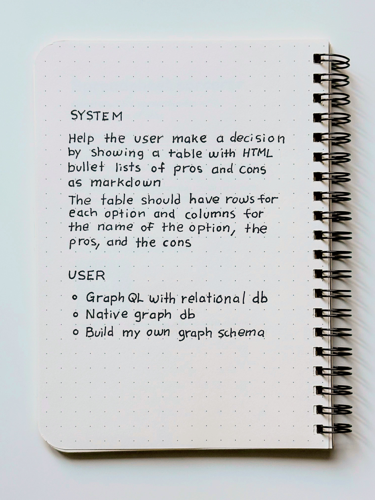
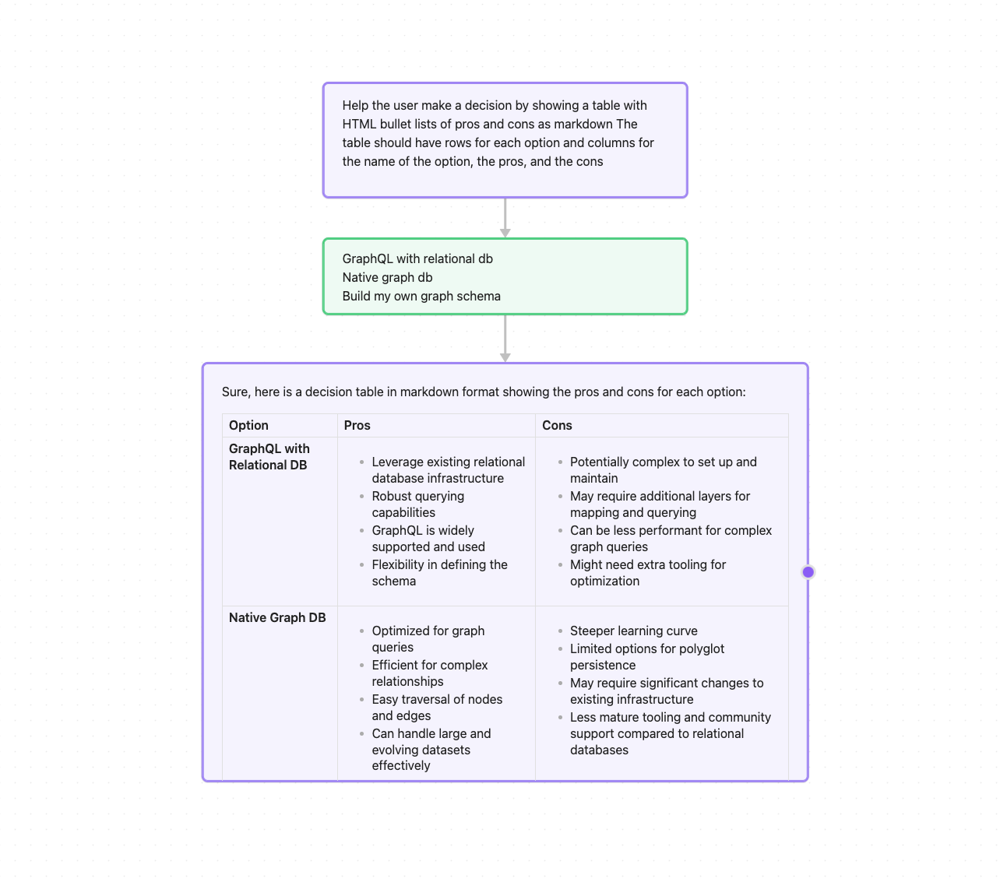
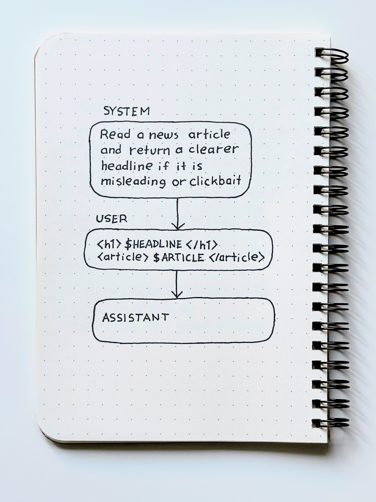
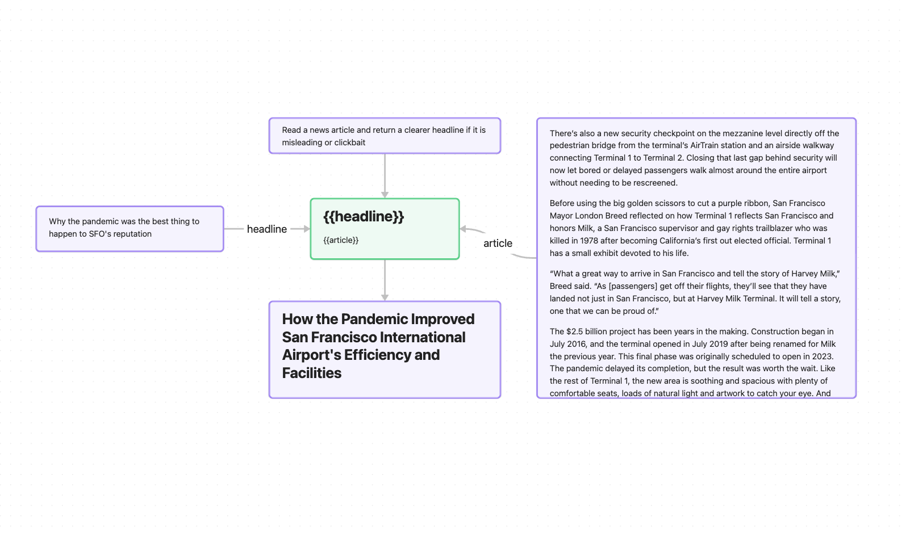
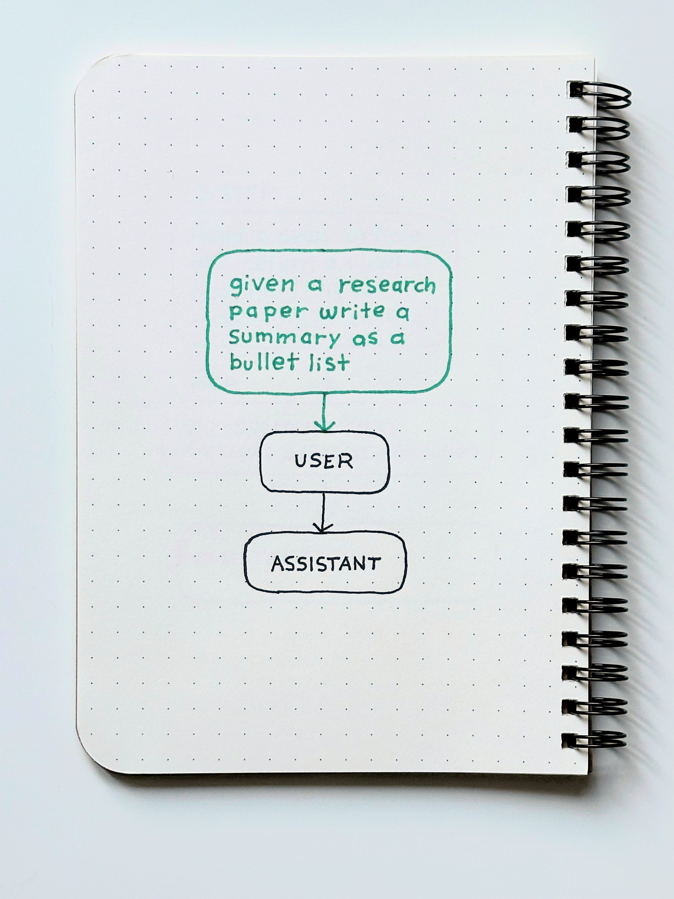
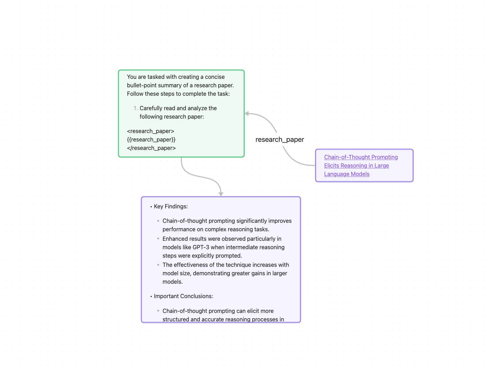

# Sketch2Canvas

Crafting effective prompts is as much an art as it is a science. Sketch2Canvas is a research prototype that focuses on the creative aspects of prompt crafting by letting you sketch your ideas with pen and paper and then use AI to automatically turn them into an executable prompt flow.

How is sketching prompts with pen and paper different from existing approaches?

1. It reframes prompt crafting from a process of technical optimization to a process of creative experimentation.
2. The "low-stakes" feel of doodling on paper encourages more playful, divergent thinking. 
3. It demonstrates progressive enhancement, allowing beginners to start with a simple idea, observe the model's response, and incrementally enrich the prompt until they achieve the desired results.
4. Pen and paper can create useful constraints, reducing the pressure for perfection and making it feel more like writing poetry.

Computer programming has always been about creating useful abstractions to communicate our ideas in a way that computers can understand and execute. Similarly, sketching is about abstracting away details so that we can communicate our ideas visually. Sketch2Canvas combines these two concepts, allowing users to express their ideas visually and then translate them into a format that can be executed by language models.​​​

## Setup

In order to be able to scan your sketches and convert them to [JSON Canvas](https://jsoncanvas.org), you will need to install a NextJS web app and setup the [Cannoli plugin]( https://github.com/DeabLabs/cannoli) in [Obsidian](https://obsidian.md)
### Web app

Start by cloning the code for the web app from GitHub:

```sh
git clone https://github.com/narphorium/sketch2canvas
```

The open the `sketch2canvas` directory and install the app.

```sh
npm install
```

Once all the dependencies are installed you can start the web app like this:

```sh
npm run start
```

This should start a server at http://localhost:3000 with the Sketch2Canvas tool.

The first time that you run the app you will need to give it permission to access your webcam. If you prefer you can also upload images without the webcam.
## Environment

In order to use the app, you will need an [Anthropic API key](https://docs.anthropic.com/en/api/getting-started). 

Add your Anthropic API key to the  `.env.local` file in the root of the web app directory and restart the web app:

```ini
ANTHROPIC_API_KEY=your-api-key
```

### Obsidian

If you don’t already have it, [download and install]( https://obsidian.md/download) Obsidian.

Choose a directory for your Obsidian vault and add the path to your `.env.local` file and restart the web app:

```ini
OBSIDIAN_VAULT=/path/to/your/vault
```

Now setup the [Cannoli plugin]( https://github.com/DeabLabs/cannoli) so that you can run your prompts directly in Obsidian:

1. Open **Settings** and go to the **Community plugins** tab.
2. Under **Restricted mode**, click **Turn on and reload**.
3. Under **Community plugins**, click **Browse** then use the search field at the top of screen to search for “Cannoli”.
4. Select **Cannoli** and click **Install**.
5. Click the "x" to close the plugin directory.
6. You should now see **Cannoli** listed under your **Installed Plugins**
7. Flip the toggle switch beside the **Cannoli** plugin to enable it for your vault.
8. Now click the gear icon beside the **Cannoli** plugin and add your API key so that Cannoli can make calls to an LLM.

> [!NOTE]
> Unfortunately the Anthropic client [is currently not working](https://github.com/DeabLabs/cannoli/issues/41) in Cannoli so you will need to use another provider if you want to run your canvases.

Now there should be a Cannoli icon in the left activity bar. When you have an Obsidian canvas file open you can click this button to run the prompt.

## Usage

Once you have the web app running locally and an Obsidian vault to store your generated canvases you can start experimenting with different types of prompts.

When you open the web app you will see the option to either **Use Webcam** or **Use Image** .

- **Use Webcam** will ask for permission to use your webcam to scan your prompts. It is recommended to arrange your camera so that it is pointing straight down so the sketch is not tilted, skewed or in shadows.
- **Use Image** will open a file dialog to let you upload a PNG file with your sketch. Make sure that the image is large enough for the model to be able to recognize the text.
 
### Text prompts

<div>
    
    
</div>

If you have some handwritten prompts with examples like in the Anthropic Sample Prompts notebook, you can easily scan those into Obsidian to make them executable.

1. Click the gear button to open the settings menu and make sure that **Use Cannoli format** is NOT checked for text-only prompts.
2. Make sure that the output path to your Obsidian vault is set in settings.
3. Enter a **Name** which will be used to save your canvas in Obsidian.
4. Click **Generate** to turn the sketch into a canvas.

### Sketches

Sketching out prompts as flowcharts make it easier to turn them into executable canvases and Sketch2Canvas can automatically format them so that they work with the Cannoli plugin.

1. Click the gear button to open the settings menu and make sure that **Use Cannoli format** is  checked.
2. Make sure that the output path to your Obsidian vault is set in settings.
3. Enter a **Name** which will be used to save your canvas in Obsidian.
4. Click **Generate** to turn the sketch into a canvas.

Claude doesn’t always get the size and position of the nodes exactly right so you may need to  make sure manual adjustments to make the prompts easier to read.

### Variables

<div>
    
    
</div>

Often, prompts will take additional context provided by the user at runtime. We can use `$VAR` syntax in our sketches to specify where these values should be inserted in the prompt.

Sketch2Canvas can automatically extract these variable into separate nodes in the canvas so that you can type in custom values or even link to other notes in your Obsidian vault to provide context to the prompt.

1. Click the gear button to open the settings menu and make sure that **Use Cannoli format** is  checked.
2. Make sure that the output path to your Obsidian vault is set in settings.
3. Make sure that **Variable pattern** matches the format that you use in your sketch.
4. Enter a **Name** which will be used to save your canvas in Obsidian.
5. Click **Generate** to turn the sketch into a canvas.

Make sure to fill in the variable nodes with values before running your prompt with Cannoli.

### Metaprompting

<div>
    
    
</div>

This is where the power of AI-powered sketches really becomes clear. We can add green text to our sketches to provide descriptions of what a prompt should do and then let Claude write the prompt for use using a [Metaprompt](https://colab.research.google.com/drive/1SoAajN8CBYTl79VyTwxtxncfCWlHlyy9). This frees us to focus on the flow and purpose of the prompt without having to write everything out in detail.

1. Click the gear button to open the settings menu and make sure that **Use Cannoli format** is  checked.
2. Make sure that the output path to your Obsidian vault is set in settings.
3. Make sure that **Use metaprompt** is enabled in settings.
4. Enter a **Name** which will be used to save your canvas in Obsidian.
5. Click **Generate** to turn the sketch into a canvas.

You will need to experiment with your metaprompts to find conventions which lead to good prompts